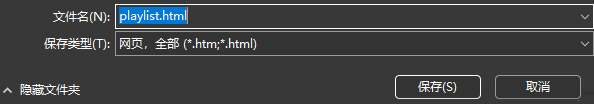

# QUARTER: QQ Music Playlist Report Generator

## 简介

QUARTER是一个QQ音乐歌单报告生成器，可以根据QQ音乐歌单生成歌单报告。

目前支持的功能有：

- 统计歌单中歌曲的歌手分布情况
- 统计歌单中歌曲的专辑分布情况
- （受API限制，web端仅能获取这些信息TAT）

考虑未来可能会增加的功能：

- 统计歌曲名称中、歌词中的关键字出现频率与词云
- 统计语种、流派等信息（似乎需要安卓客户端）
- 统计歌单中歌曲的播放次数排行（似乎需要安卓客户端）

## 依赖

- Python 3
- jieba
- bs4

## 使用方法

- 将希望分析的歌单通过客户端生成分享链接，其格式形如：

```url
https://c6.y.qq.com/base/fcgi-bin/u?__=<token:xxxxxx>
```

- 将链接复制到Web浏览器中打开，重定向后的网页url如下所示，其中包含纯数字形式的歌单id：

```url
https://y.qq.com/n/ryqq/playlist/<id:yyyyyy>
```

- 将id ```yyyyyy``` 复制到下述链接中，打开浏览器访问：

```url
https://y.qq.com/musicmac/v6/playlist/detail.html?id=<id:yyyyyy>
```

- 在打开的网页中按下 `Ctrl+S`，选择以单个文件保存，保存为 `playlist.html`，放置在子目录`./webpage`下。



- 运行 `main.py`：

```shell
python3 main.py
```

## 示例

现在的示例是一个我创建的简易歌单，已经放置在了webpage文件夹下。
直接运行 `main.py`即可生成一个示例报告。


## 备注

- 本项目仅供学习交流使用，不得用于商业用途。
- 本项目使用的API均为QQ音乐网页端的API，不保证长期有效。
- QQ音乐无版权的音乐，Web端API无法拉取。
- 本项目不会保存任何用户数据，不会上传任何用户数据。
